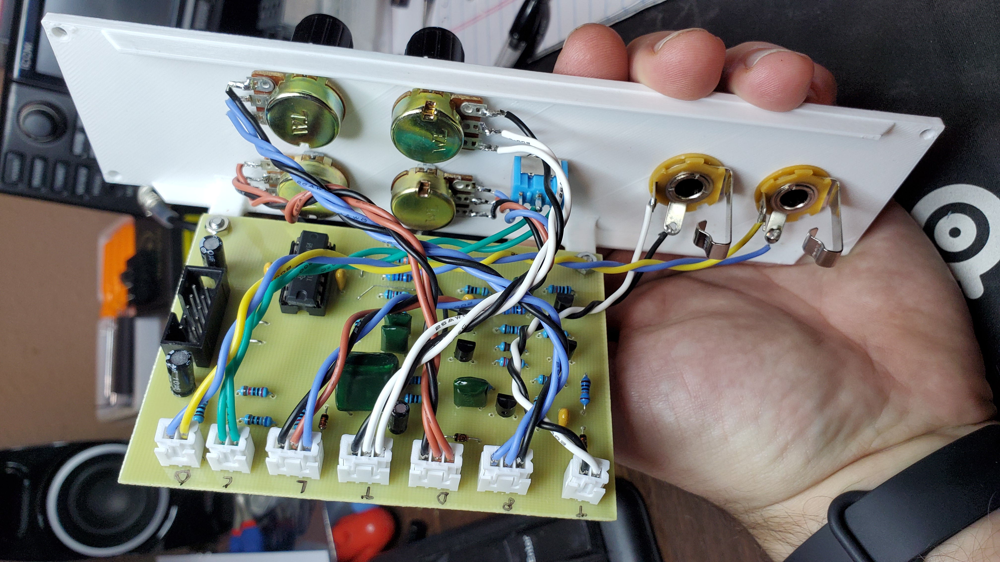
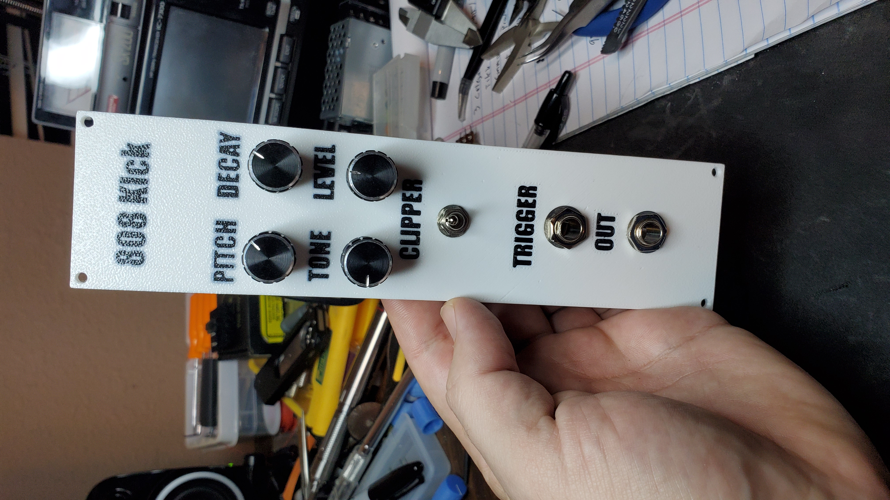
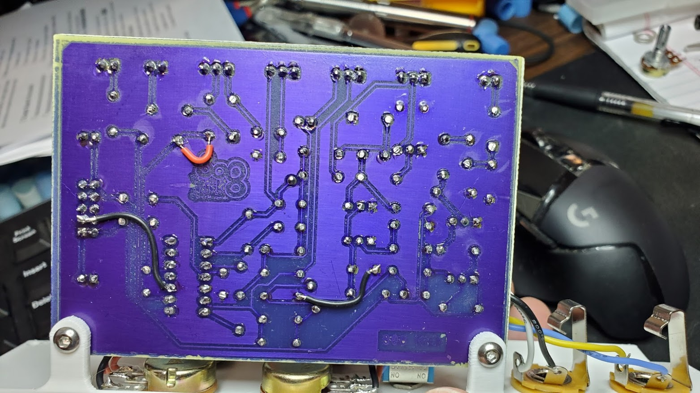

# M4TM 808 Kick

Based on a [schematic by Juanito Moore](080 schematic.JPG) (included here for reference) in his youtube video: https://www.youtube.com/watch?v=xPBeEi4SE68  Be sure to check out his great video where he shows another way to build the circuit and explains it's working in detail.

I drew up a PCB in Kicad and etched it myself mostly as an excuse to learn how.  I used UV dry transfer film and transfered my layout by printing it inverted on vellum to make a negative.  Took me a few tries to get the process down but was able to etch this board successfully and get it working.

Note: The version I built and show in the photo above is different than what I'm including.  After buidling it I made two small changes eliminating the need for the two black jumpers on the back of the board pictured above.  Also the red jumper was to fix a trace I damaged when drilling the board.  The only jumpers this board should need are on the front and shows as front traces in the Kicad files.

No gerbers included but you should be able to export them from kicad easily enough.  I did include the exported PDF's and Photoshop files I used to prepare my negative for etching