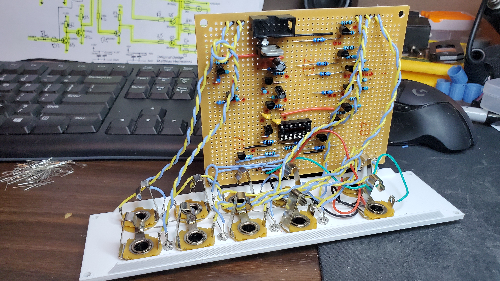

#Clock Divider

Based on a [schematic by Niklas Ronnberg](http://familjenronnberg.se/~niklas/diy/eurorack/divider/) (included here for reference) which in turn was based on a prior design by Matthias Herrmann for his Fonitrokik synth.

I added the 1:64 and 1:128 divisions and designed a stripboard layout and panel for it.  

This is based around a full sized piece of "large" stripboard from Tayda electronics - however there is a minor discrepency in size due to "margins" on the boards from Tayda so the mounts designed into the panel are slightly off - I had to drill a new hole in the board to compensate for this.

